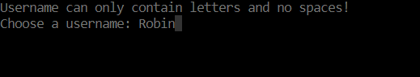
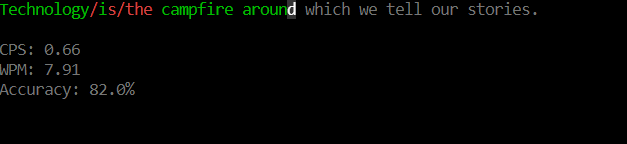
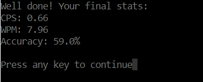
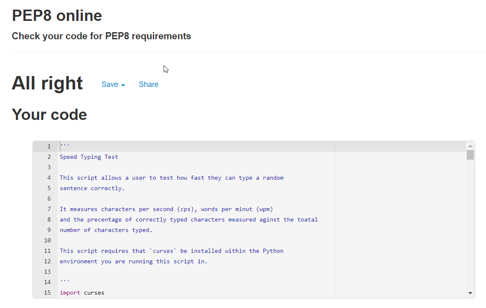

# Terminal Speed Typing Test

**Version 1.0.0**

This speed typing test works like most others, it is however in the terminal. It measures characters per second (cps), words per minute (wpm)
and accuracy the percentage of correctly typed characters measured against the total number of characters typed. 

## Table of Contents

1. [Features and Rules](#Features-and-Rules)
2. [Testing](#Testing)
3. [Technologies Used](#Technologies-Used)
4. [Deployment](#Deployment)

---

## Features and Rules

### __Teminal__
- The app can be run in the command prompt (cmd), in a python shell, or in any other app that can read and run python code.

### __Rules__
- The user types characters when the target sentence is displayed.
- The characters should match the target sentence for the game to end.

### __Username__
- The user will be asked to enter their username before the game begins.
- If the name only contains alphabetic characters the username will be accepted.

### __Display__
- The target text to be copied by the user is displayed.
- Below the target text is the CPM, wpm, and accuracy displayed. These will be updated continuously during the test even when the user is not typing.
- When the user types; the relevant character in the target string will show as either green(correct) or red(incorrect).

### __The Typing__
- A random sentence will be chosen from sentences.txt
- The user starts typing and the time starts.
- The cps is calculated by dividing the current amount of characters typed by the elapsed time
- The wpm is calculated by dividing the current amount of characters by the elapsed amount of minutes and then dividing that by the average word length of the target sentence.
- The accuracy is calculated by dividing the correctly typed characters by the total amount of characters typed.
- Once the user is finished typing the sentence, the user presses the ENTER key.
- If the sentences do not match the test continues and the user can fix the issue and try to hit ENTER again.
- If the sentences match the game stops and the stats stop, and the user gets to view the final result. 

## Future Improvements
- Add a leaderboard.
- Fetch random sentences from the internet.
- Code recursion.
- Possibly add classes.

[Back to top](#contents)
# Testing
Testing is been done manually by me and I've gone through all the features thoroughly.

## User Features

### Entering Username
- Typing letters in username works.
- Typing non-letters yields a prompt saying "Username can only contain letters and no spaces!".
- Typing again removes the prompt and lets the user continue writing their username.
- Using the backspace key works as expected.
- Pressing ENTER saves the username.

### Typing in Test 
- Generates a random sentence from sentences.txt as intended.
- Typing correctly yields GREEN characters as expected.
- Typing incorrectly and typing more characters than the target sentence yields RED characters as expected.
- Typing a space incorrectly yields a red "/".
- Using the backspace key works as expected.
- Pressing ENTER before the sentence is correctly typed doesn't end the game; as intended.
- The program recognizes when the target sentence and the typed sentence match and ends the game when ENTER is pressed. 

### CPS, WPM and Accuracy
- CPS
    - Updates continuously.
    - Calculates it correctly.
    - Updates when backspace is pressed.

- WPM
    - Updates continuously.
    - Calculates it correctly.
    - Updates when backspace is pressed.

- Accuracy
    - Updates continuously.
    - Calculates it correctly.
    - Updates when backspace is pressed.

### End Screen
- Asks user to play again.
- Pressing "ESC" ends the program.
- Pressing any other key initiates a new typing test.

## Validator Testing
- Python
    - No errors were returned when passing through the official [PEP8 validator](http://pep8online.com)

### Bugs
- There are no known bugs.

### Solved Bugs
- Installing curses
    - Background: I had big issues installing curses. When I tried to install it with pip, it couldn't be installed. I had to install the python version called windows-curses. I was able to install it with pip but now, and even though pip told me time and time again that it was already installed, the python interpreter told me it didn't exist. 
    
    - Solution: So it took days to figure out but eventually I figured it out. Turns out that my pip was installing to a different python path as I had python installed on my laptop from before. When I deleted the previous python version I was now able to use curses.

- Couldn't use "backspace"
    - Background: This was my first time using the "curses" module so it took some time to learn and understand it. Apparently, you can't use press backspace for backspace. As it turns out it will just log it as any other key. 
    
    - Solution: So to use "backspace" you would need to remove the last character pressed from the list that stores the pressed keys so that it won't be printed to the screen the next time the typed characters are printed out to the terminal.

- Flickering "nodelay" Method
    - Background: I wanted to use the nodelay method to make the stats update continuously. But the terminal started to flicker and become slow when I had it activated. The reason for this was that it updated at a ridiculous speed. 
    
    - Solution: So I solved this by putting a "time.sleep" of 5/100 of a second at each loop in the run function while loop.

- Crashes When Scrolling in Terminal
    - Background: The program crashed each time scrolled or if I had printed too many lines in the terminal. It crashed when printed to too many lines because curses don't allow scrolling in the terminal, it has a fixed size. So when the terminal ran out of space it crashed. Also, the cursor or the scrolling is registered as a key by curses so in the run function it was registered in such a way that it could not be converted to an int for the ord() method and then crashed. In the get_username function, scrolling was again registered as a key so it caused the function to recognize it as an invalid character and printed out "Username can only contain letters and no spaces!" until the terminal overflowed and crashed. 
    
    - Solution: In the run function put it in a try/except statement. In the get_username function, I changed it so that it clears and rewrite it every time so it never fills up.

[Back to top](#contents)
## Technologies Used

- [Gitpod](https://gitpod.io/)
- [Github](https://github.com/)
- [PEP8](http://pep8online.com/)
- Curses module
- Time module
- Random module

[Back to top](#contents)
## Deployment
### To deploy the project
This application is deployed using [Heroku](https://heroku.com/).

The steps for deploying through [Heroku](https://heroku.com/) are as follows:

1. Visit [Heroku](https://heroku.com/) and make sure you are logged in.
2. Click on New and then choose New App.
3. Choose a name for your app and then choose your region.
4. Then press 'Create app'.
5. Make sure you are on the 'Deploy' tab.
6. Choose connect to GitHub account.
7. Search for your repository that you want to deploy.
8. Press 'Connect'
9. Choose if you want automatic deploys from your repository on GitHub.
10. Choose which branch you want to deploy.
11. Press 'Deploy Branch'.
12. When the installation is done. Go to the settings tab.
13. Press on 'Reveal Config Vars'.
14. Add config vars that are necessary.
15. Add the buildpacks needed. In this project, it was Python and Nodejs.
16. Now you are done and can open the app!

### Forking the repository on GitHub
A copy of the repository can be made. This copy can be viewed and changed on another account without affecting the original repository.

The steps for doing this:
1. Make sure you are logged in on GitHub and then find the repository.
2. On the top right there is a button called Fork.
3. Press the Fork button to make a copy to your account.

### How to clone the project
This is how you make a clone of the repository:

1. Click on the code tab under the repository name.
2. Then click on "Code" button to the right above the files listed.
3. Click on the clipboard icon to copy the URL.
4. Open Git Bash in the IDE of your choice.
5. Change the working directory to where you want your cloned directory.
6. Type `git clone` and then paste the URL that you copied.
7. Press enter and the clone has been finished.